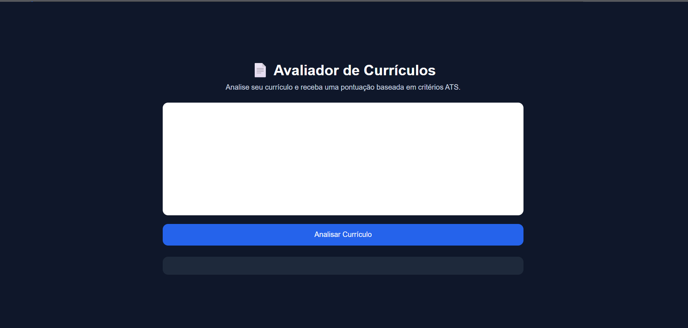
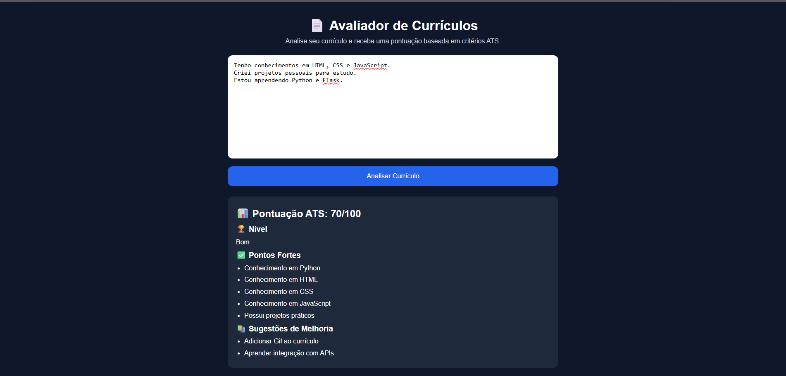

📄 Avaliador de Currículos

Aplicação web desenvolvida com HTML, CSS e JavaScript para análise de currículos baseada em critérios ATS.

O sistema identifica habilidades presentes no currículo, calcula uma pontuação e fornece sugestões de melhoria para aumentar a competitividade do candidato.

🚀 Funcionalidades

* Análise automática do currículo
* Pontuação ATS
* Identificação de habilidades técnicas
* Sugestões de melhoria
* Interface responsiva
* Execução local sem necessidade de banco de dados

🛠️ Tecnologias Utilizadas

* HTML5
* CSS3
* JavaScript

📊 Critérios Avaliados

O sistema verifica a presença de:

* Python
* HTML
* CSS
* JavaScript
* Git
* GitHub
* Projetos práticos
* APIs

Com base nesses critérios é gerada uma pontuação ATS de 0 a 100.

📷 Demonstração

Cole o texto do currículo e clique em “Analisar Currículo”.

O sistema exibirá:

* Pontuação ATS
* Nível do candidato
* Pontos fortes
* Sugestões de melhoria

📁 Estrutura do Projeto

avaliador-de-curriculos/

├── index.html

├── style.css

├── script.js

└── README.md

▶️ Como Executar

1. Baixe ou clone o projeto.
2. Abra o arquivo index.html em qualquer navegador.
3. Cole o currículo.
4. Clique em “Analisar Currículo”.

🎯 Objetivo

Projeto desenvolvido para praticar:

* HTML
* CSS
* JavaScript
* Manipulação do DOM
* Lógica de programação
* Desenvolvimento Front-End

🔮 Melhorias Futuras

* Upload de PDF
* Integração com IA
* Exportação da análise
* Dashboard de resultados
* Histórico de análise

